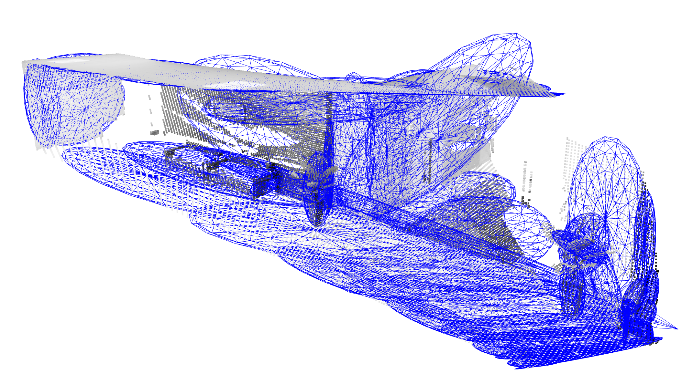
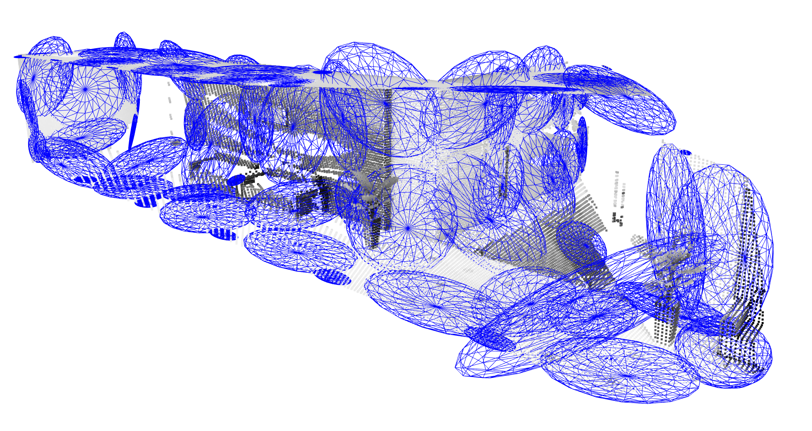
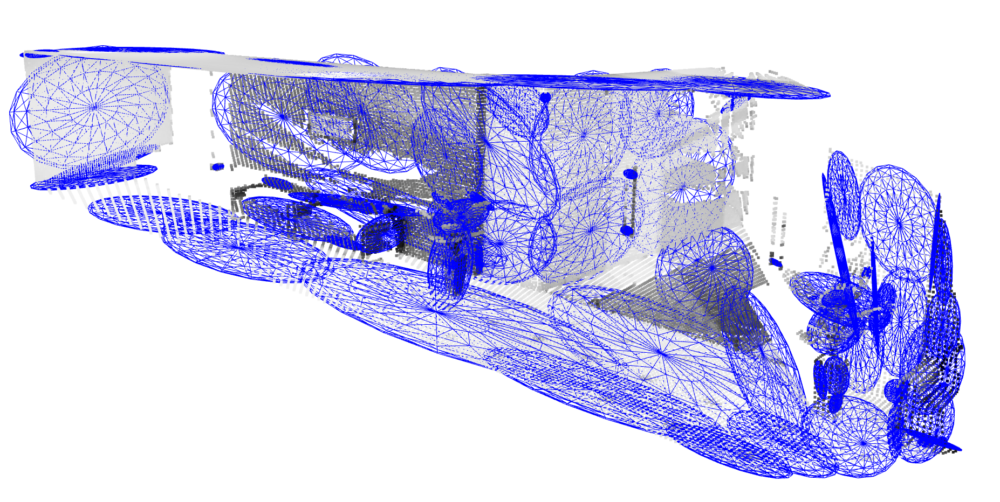
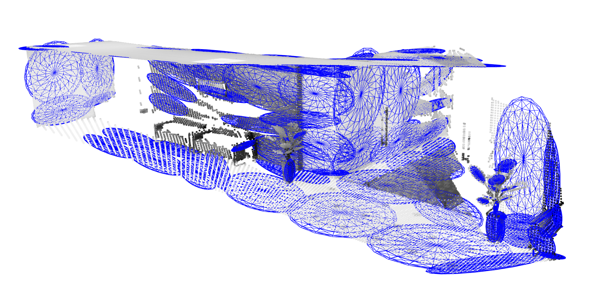

# SPGF: Memory-Efficient Gaussian Fitting for Depth Images in Real Time #
Computing consumes a significant portion of energy in many robotics applications, especially the ones involving energy-constrained robots. In addition, memory access accounts for a significant portion of the computing energy. This repository contains an memory-efficient algorithm called **Single-Pass Gaussian Fitting (SPGF)** that constructs a Gaussian Mixture Model (GMM) given a depth image in real time using only a low-power ARM CPU. The resulting GMM can be used to create a compact 3D map of the environment and perform robust registration.

## Publication
You can find our ICRA publication on IEEE [here](https://ieeexplore.ieee.org/document/9811682).

For mapping a 3D environment, the following existing work reduce the map size while incurring a large memory overhead used for storing sensor measurements and temporary variables during computation.
1. [Hierarchical EM](https://jankautz.com/publications/AccGenMod_CVPR16.pdf) (H-EM)
2. [Normal Distribution Transform](https://journals.sagepub.com/doi/abs/10.1177/0278364913499415) (NDT)
3. [Region Growing](http://www.roboticsproceedings.org/rss16/p073.pdf) (RG)

In the following figure, we compare SPGF against existing works by visualizing the GMMs (blue ellipsoids) constructed from a depth image of a hallway from the TartanAir Office dataset. Compared with existing works (a, b, c), SPGF (d) generates a more accurate GMM representation, requires significantly less memory overhead, executes in real time (i.e., >30fps), and consumes much less energy using an ARM Cortex-A57 CPU on the NVIDIA Jetson TX2.

|            |  |
:-------------------------:|:-------------------------:
 |  
 (a) **H-EM**: RMSE: 13cm, Memory overhead: 6MB, Throughput: 0.0007fps, Energy: 2756J/image.| (b) **NDT**: RMSE: 15cm, Memory overhead: 3.5MB, Throughput: 6.31fps, Energy: 0.36J/image.
  |  
(c) **RG**: RMSE: 11cm, Memory overhead: 0.49MB, Throughput: 0.49fps, Energy: 4.25J/image.| (d) **SPGF** (this work): RMSE: 9cm, Memory overhead: 43KB, Throughput: 32fps, Energy: 0.11J/image.

If you find our work useful, please cite it as follows:

```angular2html
@INPROCEEDINGS{spgf,
   author={Li, Peter Zhi Xuan and Karaman, Sertac and Sze, Vivienne},
   booktitle={2022 International Conference on Robotics and Automation (ICRA)},
   title={Memory-Efficient Gaussian Fitting for Depth Images in Real Time},
   year={2022},
   volume={},
   number={},
   pages={8003-8009},
   keywords={Three-dimensional displays;Program processors;Fitting;Memory management;Robot sensing systems;Cameras;Throughput},
   doi={10.1109/ICRA46639.2022.9811682}
}
```

## Source Code
Recall that SPGF generates GMM representing geometries from a single depth image. Thus, we have integrated SPGF into GMMap, our memory-efficient mapping framework that constructs a 3D occupancy map across a sequence of depth images. The source code for GMMap is released [here](https://github.com/mit-lean/GMMap). If you are just interested in SPGF, please take a look at the CPU implementation [here](https://github.com/mit-lean/GMMap/blob/master/src/gmm_map/SPGFExtended.cpp). In addition, we also provide a CUDA accelerated version [here](https://github.com/mit-lean/GMMap/blob/master/src/gmm_map_cuda/SPGFExtended.cpp#L241).

Note that the results reported in our ICRA publication were obtained using 64-bit floating-point representation for computing and storing each Gaussian. In contrast, GMMap uses 32-bit floating-point representation for each Gaussian, which we found not only preserves the fidelity of the 3D representation but also enables significantly higher throughput while reducing memory overhead by half.

## Visualization
Please look at the instructions [here](https://github.com/mit-lean/GMMap/blob/master/README.md#adopting-gmmap-to-your-applications).
